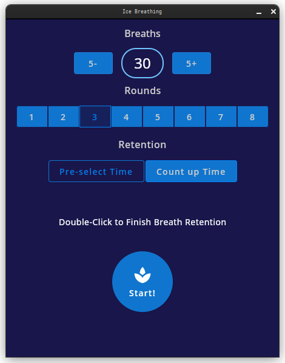
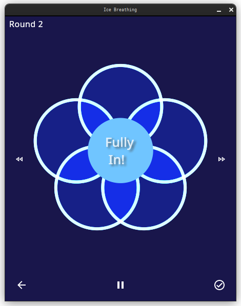
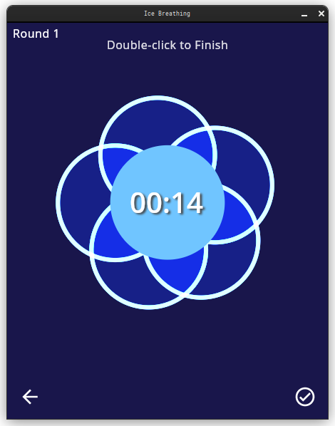
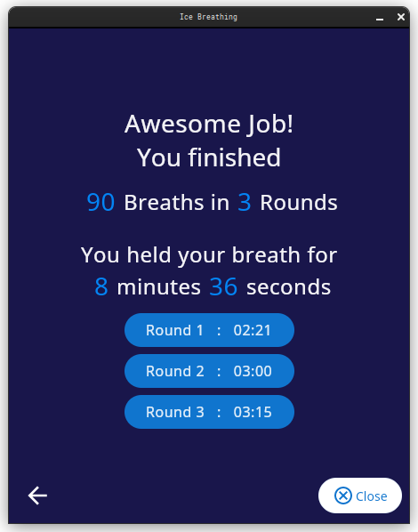

#  Ice Breathing
Open Source Kotlin Multi-platform Wim Hof breathing breathing & meditation app made for Desktop OSes (with Jetpack and JetBrains Compose),
a separate repository will hold the Android version for now.
MIT License.

Check my github pages for binary downloads for
Windows, Linux and macOS:
[Ice Breathing GitHub Pages](https://esp-er.github.io/icebreathing/)

## Desktop Screenshots

Also see [Guided Wim Hof breathing example on YouTube](https://www.youtube.com/watch?v=tybOi4hjZFQ),
for an example of this breathing method.
